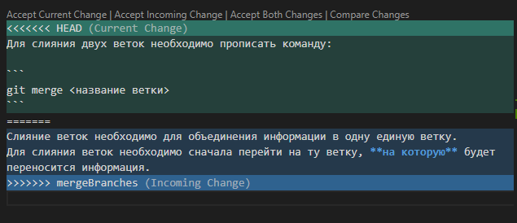

# Работа с Git

## 1. Проверка наличия установленного Git

В терминале выполнить команду `git version`

Если Git установлен, появится сообщение с информацией о версии программы. Иначе будет сообщение об ошибке.

## 2. Установка Git

Загружаем последнюю версию Git с сайта https://git-scm.com/downloads.

Устанавливаем с настройками по умолчанию.

## 3. Настройка Git

При первом использовании Git необходимо представиться. Для этого нужно ввести в терминале две команды:

```
git config --global user.name «Ваше имя английскими буквами»
git config --global user.email ваша почта@example.com
```

## 4. Инициализация репозитория

Для инициализации локального репозитория необходимо прописать в консоль команду `git init`. После ввода данной команды должно появиться следующее сообщение:

```
Initialized empty Git repository in <путь>
```

## 5. Добавление файла к коммиту

Для того, чтобы Git начал следить за изменениями созданного файла в репозитории, необходимо добавить его к коммиту. Для этого прописываем команду `git add <название файла.расширение>`

## 6. Проверка текущего состояния Git

Для того, чтобы проверить текущее состояние Git, необходимо прописать команду `git status`.

Если файл не был добавлен к коммиту, то результат выполнения команды будет следующий:

```
On branch master

No commits yet  

Untracked files:
  (use "git add <file>..." to include in what will be committed)
        test.md
```

Если файл уже был добавлен к коммиту, то результатом будет:

```
On branch master

No commits yet

Changes to be committed:
  (use "git rm --cached <file>..." to unstage)
        new file:   test.md
```

После создания коммита информация о статусе выглядит следующим образом:

```
On branch master
nothing to commit, working tree clean
```

## 7. Создание коммита

После внесения изменений в файл и добавления его к коммиту необходимо создать сам коммит. Для этого прописываем команду `git commit -m "<название коммита>"`, где `-m` (сокр. от *message*) это команда, позволяющая дать название коммиту.

После создания коммита ему присваивается персональный хэш-код. В консоли появляется информация о количестве измененных файлов и строк.

## 8. Просмотр истории всех коммитов

Для просмотра истории всех коммитов необходимо прописать команду `git log`. В результате выполнения команлы в консоли отобразится список коммитов с их хэш-кодами, названиями, временем создания и другими параметрами. 

При наличии двух и более коммитов для завершения просмотра истории необходимо выйти из меню при помощи клавиши *q*.

Для получения более короткой формы истории необходимо добавить к команде параметр `--oneline`. Итого, прописав команду `git log -- oneline`, в консоли появится история коммитов с их названиями и с сокращенными хэш-кодами.

## 9. Переход к другому коммиту

Для того, чтобы перейти к **определенному** коммиту, необходимо прописать следующую команду: `git checkout <первые семь символов хэш-кода коммита>`. Содержание файла станет таким, каким оно было к моменту создания данного коммита. 

Для того, чтобы вернуться к последней версии файла (последнему коммиту), необходимо прописать команду `git checkout master`

## 10. Проверка изменений

Для того, чтобы посмотреть изменения, внесенные в файл с момента создания последнего коммита, необходимо прописать команду `git diff`.

## 11. Игнорирование файлов

Для того, чтобы исключить из отслеживания в репозитории определенные файлы или папки необходимо создать там файл ***.gitignore*** и записать в него их названия или шаблоны, соответствующие таким файлам или папкам.

## 12. Создание веток в Git


Ветка в Git - это простой перемещаемый указатель на один из коммитов, обычно последний в цепочке коммитов. По умолчанию имя основной ветки в Git - master.

Создать ветку можно командой:
```
git branch <имя новой ветки>
```

В результате создается новый указатель на текущий коммит. 

Для создания и одновременного перехода на новую ветку можно прописать следующую команду:

```
git checkout -b <имя новой ветки>
```

## 13. Слияние веток

Слияние веток необходимо для объединения информации в одну единую ветку.
Для слияния веток необходимо сначала перейти на ту ветку, **на которую** будет переноситься информация.

Для слияния двух веток необходимо прописать команду:

```
git merge <название ветки>
```

## 14. Разрешение конфликтов

В случае, когда работа над проектом ведется параллельно на двух ветках, то при слиянии может возникать конфликт. 

Во время слияния конфликтующих изменений Git объединяет строки из разных веток, разделяя их специальными символами. При этом, Visual Studio Code помогает программисту и выдает меню с вариантами решения данного конфликта:

1. Принять текущие изменения (ветки, на которой мы находимся);
2. Принять изменения со сливаемой ветки;
3. Принять оба изменения (с двух веток одновременно);
4. Сравнить изменения.



## 15. Удаление веток

Для того, чтобы удалить ветку необходимо перейти на любую другую свободную ветку. Удалять ветку, находясь на ней, нельзя.

Для удаления ветки в Git необходимо прописать команду:

```
git branch -d <название ветки>
```

В случае, когда на удаляемой ветке есть несохраненные данные, Git сообщит об этом и предложит выполнить слияние по уже известной процедуре. Если пользователь считает, что данные на этой ветке не нужны, то можно принудительно удалить ветку. Для этого нужно прописать команду:

```
git branch -D <название ветки>
```

## 16. Изменение названия веток

Для того, чтобы изменить название ветки, необходимо перейти на эту ветку и прописать следующую команду:

```
git branch -M <новое имя ветки>
```


# Работа с удаленными репозиториями


## 1. Настройка удаленного репозитория

Для работы с удаленными репозиториями необходимо создать аккаунт на сервисе GitHub (самый популярный сервис по работе с удаленными репозиториями).

Создаем новый удаленный репозиторий на сервисе с помощью кнопки `"New"`.

* Если локальный репозиторий уже существует, то необходимо прописать следующие команды в терминале:

```
git remote add origin <url-адрес авторизированного удаленного репозитория>
git branch -M main
git push -u origin main
```

При первой попытке связать репозитории Git попросит авторизоваться одним из предложенных им способов. Это необходимо сделать для того, чтобы получить права на внесение изменений в удаленный репозиторий.

* Если локального репозитория нет, то его необходимо создать уже известным нам способом.

## 2. Размещение внесенных локальных изменений на сервисе в удаленный репозиторий

Для того, чтобы все изменения локального репозитория разместить на удаленный репозиторий необходимо прописать комманду `git push`.

## 3. Размещение внесенных удаленных изменений на сервисе в локальный репозиторий

Для того, чтобы все изменения удаленного репозитория разместить на локальный репозиторий необходимо прописать комманду `git pull`. (*pull* с англ. - "тянуть")

Следует отметить, что команда `git pull` является объедененной версией двух команд: `git fetch` и `git merge`. То есть данная команда автоматически попытается слить все изменения в текущую ветку. Во время этого процесса может возникнуть конфликт, разрешение которого аналогично разрешениию при работе с локальным репозиторием. 

## 4. Копирование репозитория с сервиса GitHub (создание локального прототипа)

Для того, чтобы скопировать репозиторий с сервиса GitHub для локальной работы с ним необходимо прописать команду: `git clone <url-адрес удаленного репозитория>`. После выполнения этой команды в текущей директории создается папка с данным репозиторием.


## 5. Создание запросов на внесение изменений в чужой удаленный репозиторий

На сервисе GitHub находится большое количество открытых проектов, т.е. любой человек может поучаствовать в их разработке.

Для того, чтобы поучаствовать в разработке чужого проекта необходимо на странице удаленного репозитория нажать кнопку `Fork`. Это необходимо для того, чтобы добавить этот репозиторий в список своих на сервисе GitHub.

После этого, копируем ссылку этого репозитория и прописываем в терминал уже известную нам команду:
`git clone <url-адрес удаленного репозитория>`

Важно перед внесением изменений создать и перейти на новую ветку, на которой будет производится вся работа. 

После внесения измений, чтобы перенести их на сервис необходимо прописать следующие команды:

```
git add .
git commit -m "<Название коммита>"
git push -u origin <название ветки>
```

теперь мы можем поделиться нашими изменениями с автором данного проекта. Для этого необходимо нажать на кнопку `create pull request` на сайте сервиса GitHub.